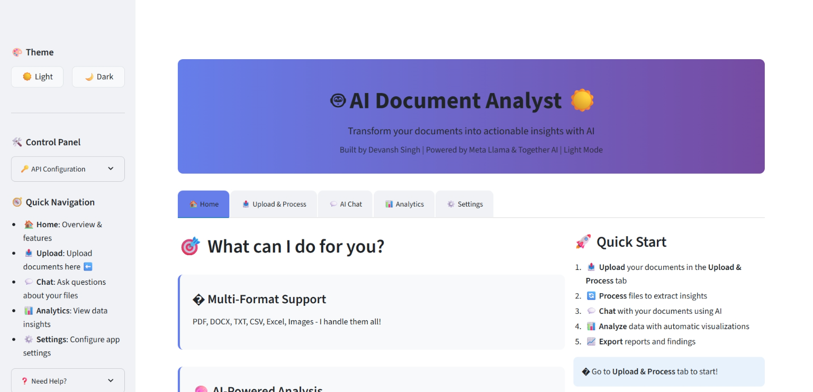
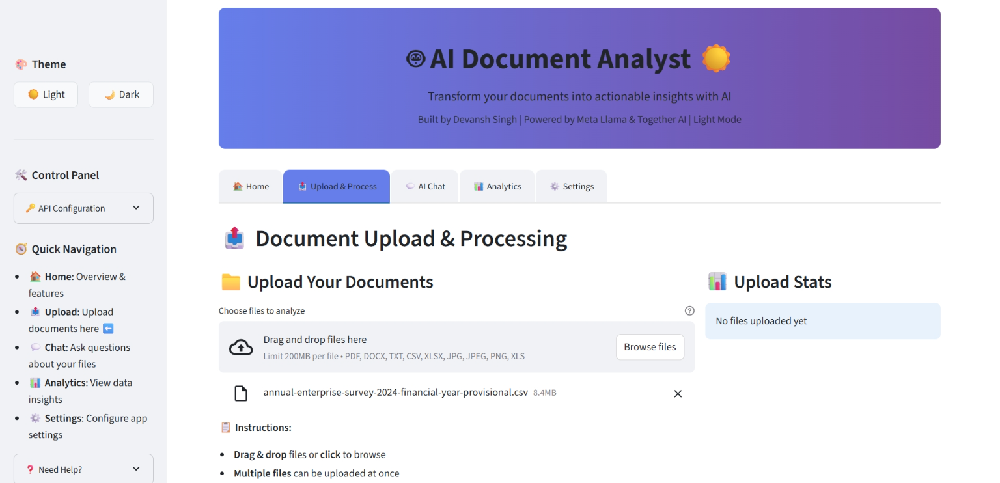
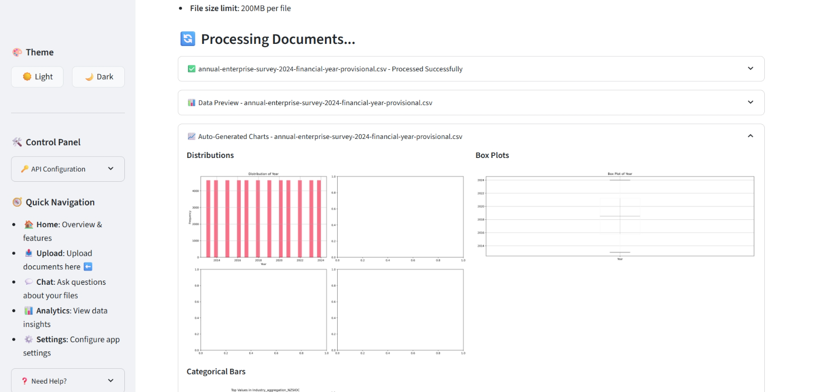
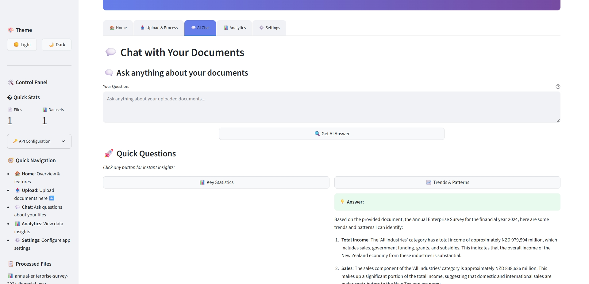
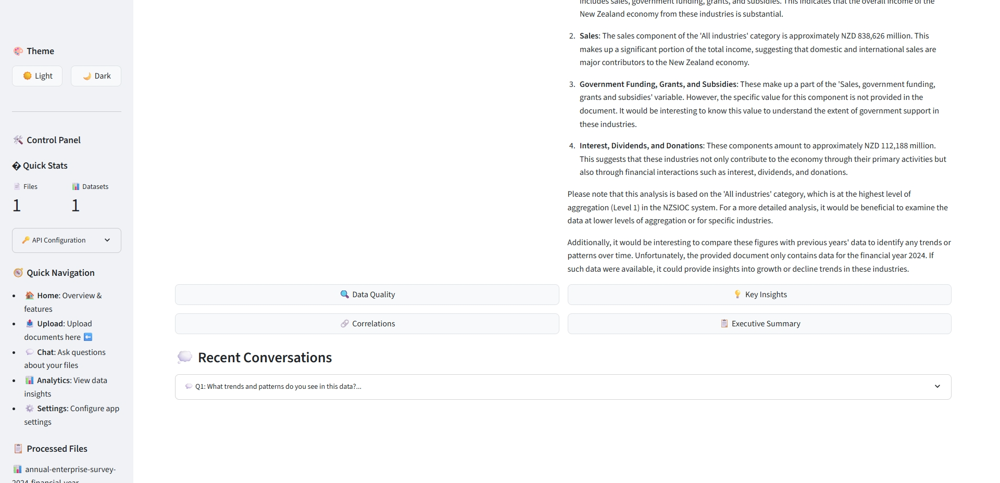
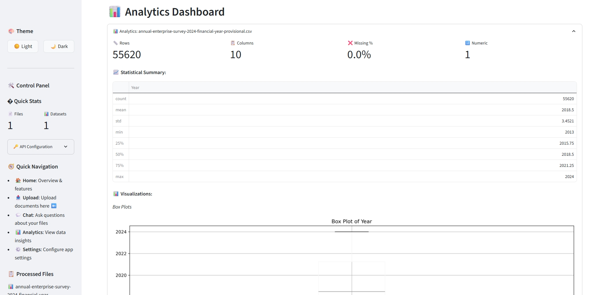
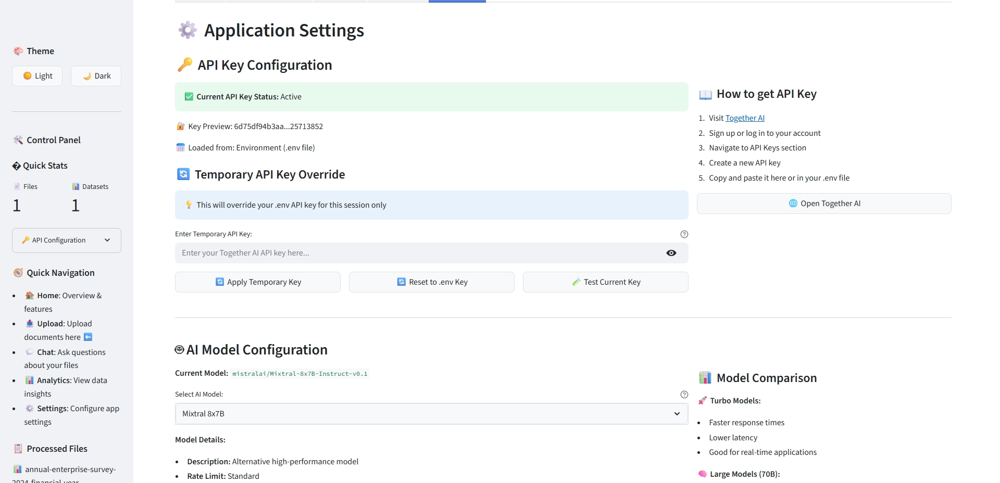
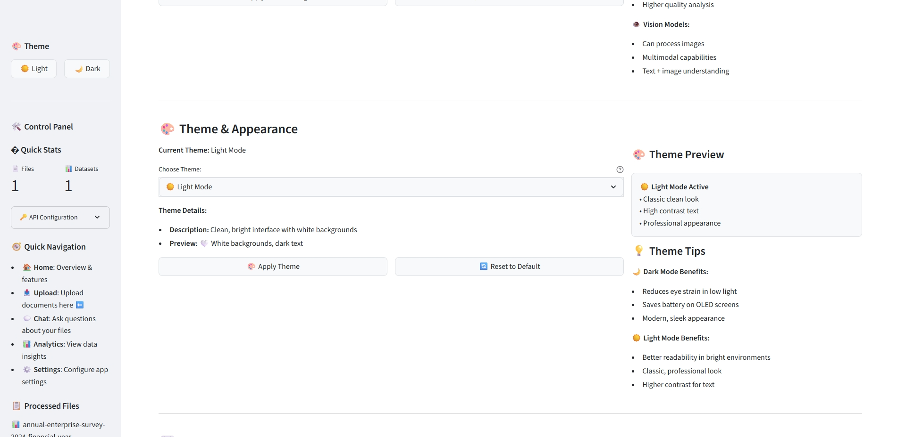

# 📊 AI Document Analyst v2.0

> _"Because reading your own documents is so 2022. Let the AI do the heavy lifting while you take all the credit. Now with 100% more dark mode!"_

---

## 😏 What Is This Masterpiece?

Welcome to **AI Document Analyst v2.0** – the tool you never knew you desperately needed, now with a complete UI makeover that'll make your other apps jealous. Built by _Devansh Singh_ (yes, I made this, and yes, I'm still waiting for my Nobel Prize).

This Python-powered, AI-infused, theme-switching, sarcasm-enabled agent will:

- **Read** your PDFs, DOCX, TXT, CSV, Excel, and even images (OCR, because why not?).
- **Summarize** them using Meta Llama models via Together AI (because free is better than expensive).
- **Analyze** your data with pandas wizardry (the Avengers of data science).
- **Visualize** trends and patterns with auto-generated charts (because you love pretty colors).
- **Chat** with your documents like they're your best friend (spoiler: they're more reliable).
- **Switch** between light and dark themes (because your eyes deserve options).
- **Generate Reports** that sound like you spent hours on them (you didn't).

All this, wrapped in a gorgeous Streamlit UI with tabs, themes, and more bells and whistles than a marching band.

---

## 🎨 What's New in v2.0? (The Glow-Up Edition)

- **🌙 Dark/Light Mode**: Toggle between themes like a pro. Your retinas will thank you.
- **📑 Tabbed Interface**: Home, Upload, Chat, Analytics, and Settings tabs. Organization is sexy.
- **🎯 Enhanced Upload**: Drag & drop files with style. Progress bars included (because waiting is fun).
- **💬 Interactive Chat**: Ask your documents anything. They actually respond now.
- **⚙️ Settings Panel**: Configure everything from AI models to themes. Power user vibes.
- **📊 Advanced Analytics**: Beautiful charts, stats, and insights that'll make Excel cry.
- **🎪 Better UI**: Modern gradients, cards, and animations. Instagram-worthy data analysis.

---

## 📸 Screenshots

> Glimpses! So you know it actually works 😁

<div align="center">
<table>
<tr>
<td align="center"><br><b>🏠 Home Dashboard</b></td>
<td align="center"><br><b>📤 Upload & Process</b></td>
</tr>
<tr>
<td align="center"><br><b>📊 File Processing</b></td>
<td align="center"><br><b>💬 AI Chat Interface</b></td>
</tr>
<tr>
<td align="center"><br><b>🤖 Chat Conversation</b></td>
<td align="center"><br><b>📊 Analytics Dashboard</b></td>
</tr>
<tr>
<td align="center"><br><b>⚙️ Settings Panel</b></td>
<td align="center"><br><b>🌙 Dark Mode Settings</b></td>
</tr>
</table>
</div>

> The UI may differ slightly if I decided to tweak it and forgot to update screenshots. JK! (But seriously, it might.)

---

## 🚀 Features (Because You're Too Busy to Read the Code)

### 🏠 **Home Tab**

- Welcome dashboard with feature overview
- Quick start guide (for the impatient)
- Status indicators (so you know things are working)

### 📤 **Upload & Process Tab**

- **Multi-format Support:** PDF, DOCX, TXT, CSV, XLSX, JPG, PNG, and more
- **Drag & Drop Interface:** Because clicking is so 2010
- **Real-time Processing:** Watch your files get analyzed in real-time
- **Progress Tracking:** Know exactly what's happening (transparency is key)
- **Auto-Visualization:** Charts generate themselves (like magic, but with code)

### 💬 **AI Chat Tab**

- **Conversational Q&A:** Ask anything about your documents
- **Context Awareness:** Remembers your conversation (better than most humans)
- **Quick Questions:** Pre-built buttons for instant insights
- **Smart Responses:** Powered by Meta Llama models via Together AI

### 📊 **Analytics Tab**

- **Statistical Summaries:** Mean, median, mode, and other math-y things
- **Data Quality Checks:** Missing values, duplicates, outliers
- **Correlation Analysis:** Find relationships you never knew existed
- **Auto-Generated Charts:** Histograms, heatmaps, box plots, and more

### ⚙️ **Settings Tab**

- **API Key Management:** Built-in key configuration (no more .env hunting)
- **Model Selection:** Choose from multiple AI models
- **Theme Switching:** Light/Dark mode toggle
- **Processing Settings:** Customize AI behavior
- **Session Management:** Reset everything when you mess up

---

## 🛠️ How to Run (Because Reading Instructions Is Actually Important)

### 1. **Install Requirements:**

```sh
pip install -r requirements.txt
```

(Or just install everything you see in the imports. I believe in your package management skills.)

### 2. **Run the App:**

```sh
python Data_Analyst_Agent.py
```

Or, if you're feeling fancy:

```sh
streamlit run Data_Analyst_Agent.py
```

### 3. **Open Your Browser:**

- The app will automatically open at `http://localhost:8502`
- If it doesn't, manually navigate there (I can't click for you)

### 4. **Start Analyzing:**

- The app includes a **free API key** (yes, FREE!)
- Just upload your files and start chatting
- No complicated setup required

---

## 🔑 API Key (Now 100% Free!)

**Good news!** I've decided to be generous and provide my own Together AI API key with the app. Why? Because:

- Together AI is essentially free for reasonable usage
- You shouldn't have to jump through hoops to try this
- I'm feeling charitable (it happens sometimes)

### But If You Want Your Own Key...

1. Get it from [Together AI](https://api.together.xyz/) (they're pretty cool)
2. Use the **Settings Tab** in the app to add your key
3. Or set it as an environment variable: `TOGETHER_API_KEY=your_key_here`

### Available AI Models:

- **Llama 3.1 8B Turbo** (Recommended - fast and efficient)
- **Llama 3.1 70B Turbo** (Powerful - for when you need the big guns)
- **Llama 3.2 11B Vision** (Multimodal - can see your images)
- **Mixtral 8x7B** (Alternative - because options are good)
- **Nous Hermes 2** (Conversational - optimized for chat)

---

## 🤖 How It Works (Magic, But With Science)

1. **🏠 Start at Home:** Overview of features and quick start guide
2. **📤 Upload Files:** Drag & drop your documents in the Upload tab
3. **🔄 Auto-Processing:** Text extraction, OCR, data loading - all automatic
4. **📊 Get Analytics:** Instant stats, charts, and insights in the Analytics tab
5. **💬 Chat Away:** Ask questions in the Chat tab - get smart answers
6. **⚙️ Customize:** Tweak settings, change themes, swap AI models
7. **📈 Export Results:** Screenshots, insights, whatever you need

---

## 🎯 Why Use This? (Besides My Incredible Ego)

- **Zero Setup Hassle:** API key included, just run and go
- **Beautiful UI:** Dark mode, themes, modern design
- **Actually Smart:** Real AI analysis, not just fancy buttons
- **Multiple File Types:** PDF, Excel, images - it reads everything
- **Conversation Memory:** Ask follow-up questions like a normal human
- **Free to Use:** No hidden costs, no subscription nonsense
- **Regular Updates:** I actually maintain this thing

---

## 🔧 Installation Troubleshooting

If you encounter any errors (because software is never perfect):

### Numpy/Pandas Issues:

```bash
pip uninstall numpy pandas -y
pip install numpy==1.24.3
pip install pandas==1.5.3
pip install -r requirements.txt
```

### Streamlit Issues:

```bash
pip install --upgrade streamlit
```

### API Issues:

- The built-in API key should work automatically
- If not, get your own from [Together AI](https://api.together.xyz/)
- Add it in the Settings tab or as an environment variable

---

## 📝 Credits & Thanks

Made with excessive amounts of coffee, determination, and a healthy dose of sarcasm by **Devansh Singh**.

Special thanks to:

- **Together AI** for their awesome API
- **Streamlit** for making beautiful UIs possible
- **Meta** for Llama models that actually work
- **You** for using this instead of doing manual analysis

---

## ⚠️ Disclaimer

- This tool is for educational and productivity purposes
- AI responses are smart but not infallible (unlike me)
- No documents were harmed in the making of this agent
- Dark mode may cause addiction to superior UI experiences
- Free API usage is subject to reasonable limits (don't abuse it)

---

## 💌 Feedback & Support

- Open an issue on GitHub (I actually read them)
- Email: dksdevansh@gmail.com (for serious stuff)
- Or just scream into the void (therapeutic but less helpful)

---

## 🎉 Recent Changes (v2.0 Summary)

### Major UI Overhaul:

- **Complete redesign** with modern tabbed interface
- **Dark/Light theme system** with persistent settings
- **Enhanced file upload** with drag & drop and progress tracking
- **Interactive chat interface** with conversation history
- **Comprehensive settings panel** for customization

### Functionality Improvements:

- **Built-in API key** for immediate use
- **Multiple AI model support** with easy switching
- **Better error handling** and user feedback
- **Auto-generated visualizations** with improved styling
- **Session management** and data persistence

### Developer Experience:

- **Cleaner codebase** with better organization
- **Improved CSS theming** with CSS variables
- **Better responsive design** for different screen sizes
- **Enhanced accessibility** with proper contrast ratios

### What Changed:

1. **From single page** → **5-tab interface** (Home, Upload, Chat, Analytics, Settings)
2. **Basic styling** → **Professional dark/light themes**
3. **Manual API setup** → **Built-in free API key**
4. **Simple file upload** → **Drag & drop with progress tracking**
5. **Basic Q&A** → **Interactive chat with memory**
6. **Hidden settings** → **Dedicated settings panel**
7. **Static UI** → **Dynamic, responsive interface**

---

Enjoy the new and improved document analysis experience! (Or don't, but at least it looks pretty now) 🚀
